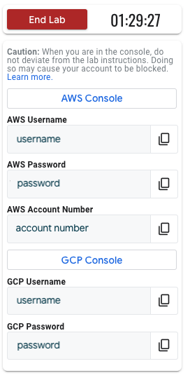

# GitHub Bundles

> **Version 1**
>
> This is a DRAFT document. We welcome feedback as this format evolves.

## Concepts

The Qwiklabs Bundle Spec provides an interchange format for qwiklabs resources
(_entities_) across our ecosystem. The spec is used extensively to support
our content distribution and processes across many customer deployments and
has allowed us a great deal of systemization and automation.

While not
explicitly referenced in the spec, perhaps the most important contribution
is the notion of "universal" content identifiers (`content_id`)
that let us easily reference and report on particular pieces of content across
multiple systems and databases. These
identifiers are always included as a required parameter for requests made to
our PublisherApi to create, update or delete content. Though the `content_id` is
required, the bundle spec does not actually specify how they should be
constructed, rather that is up to a particular integrator to determine for
themselves.

At Qwiklabs we view content management for labs, quizzes, quests and courses
much like software source control management and so we have decided to use
GitHub as our CMS/persistence layer on top of the Qwiklabs Bundle Spec.


## GitWhisperer Integration

GitWhisperer is our integration layer for content creators and helps with
content management in many critical ways by
- generating content_ids and inferring base fields based on the Git repo layout
- using **QL_OWNER** files to assign lab ownership on Qwiklabs staging deployments
- simplifying the translation pipeline
- compiling instructions from Markdown to HTML so production applications can be unified for rendering
- handling common instruction fragments
- compiling Activity Tracking assessments from individual base "step" files

For GitHub integration, the base repository (e.g. gcp-spl-content) has
directories for each of the supported entity types, (e.g. labs, learning_paths,
quizzes) and additionally a "/fragments" directory that contains common
instruction sections that are included by reference, such as "copyright".
The `content_id` from GitWhisperer concatenates the repo name,
which we commonly
call "library" and the directory name for a particular lab which we call the
lab "slug". In this way, GitWhisperer assigns both a `content_id` and the
base `entity` type through examining the directy structure of the repository.

The other special file is **QL_OWNER** which contains the email address of the
user on the target staging deployment to assign ownership and edit privileges.


## V2 Labs

For a particular entity type, such as V2 Labs, the GitHub bundle files will
differ in common ways from those specified in the Qwiklabs Bundle Spec
interchange format. The reason for this is to simplify localization and
content management for the authoring team and is illustrated below.


### Resource References

Sometimes it is useful to reference values that are unknown at authoring time. For example, an author may specify that a GCP Project username should be displayed to the student, but this username is not known until the lab is started. To address this, we have the concept of resource references.

A resource reference has the form `[RESOURCE_ID].[RESOURCE_ATTRIBUTE]`. Each environment resource type has an allowed set of attributes that can be referenced, defined in its "Valid resource references" section. When an attribute has type "resource reference", the value should be of this form.

Currently, this can only be used for `student_visible_outputs`, `custom_properties` (of startup/cleanup scripts), and activity tracking `resources` objects. In the future, we hope to allow interpolating these resource references into the lab instructions.

## `qwiklabs.yaml` Structure

Here's a sample `qwiklabs.yaml` file, with all nested details removed to make it easier to see the general file structure.

```yaml
entity_type: Lab
schema_version: 2
default_locale: en

title: Best Lab Ever

description: "No, seriously. It's the best lab ever. You're going to love it!"

duration: 60
level: intro
tags: [sample, life-changing, gcp]

# The primary instruction content for this lab
instruction: ...

# Other resources the learner may access while taking this lab
resources: ...

environment:
  # Lab resources that are provisioned by Qwiklabs
  #  e.g. cloud account, databases, etc.
  resources: ...

  # Properties of the lab environment that are displayed to the user
  #  e.g. gcp project, username, password. etc.
  student_visible_outputs: ...


# Checkpoint evaluation and quiz data
assessment: ...
```

Two properties are critical for specifying your lab bundle:

- `entity_type`

  This should be set to `Lab` for lab bundles. For other entity types such as `CourseTemplate` or `Quiz` please see their own bundle spec.

- `schema_version`

  This notes which version of this spec the bundle is using. The valid values are `1` (deprecated) and `2` (current).

### Default Locale

The lab bundle MUST specify a `default_locale`. It corresponds to the locale that the lab is originally authored in. Authoring tools can use this as a hint to notify localizers when content in the default locale is updated. Also, it provides a hint to the learner interface about which locale to display if an instruction/resource is not localized for the learner's current locale.

Add an additional locale specific file of the form "qwiklabs.xx.yaml"
for each locale to be included. For example, Japanese entries would be in a
file named "qwiklabs.ja.yaml".
Within a single piece of content, be sure to use consistent `ids` across
all the "qwiklabs.xx.yaml" files for data that contains lists of objects.


### Lab attributes

attribute              | required | type        | notes
---------------------- | -------- | ----------- | -----------------------------------------
title                  | ✓        | string | Unique Lab title that a student
sees
description            | ✓        | string |
duration               | ✓        | integer     | Amount of time it should take an average learner to complete the lab (in minutes)
credits                |          | integer     |
level                  |          | string      |
logo                   |          | file path   |
tags                   |          | array       |
legacy_display_options |          | array       | Elements to hide/show in ql-lab-control-panel widget

### Instructions

attribute | required | type              | notes
--------- | -------- | ----------------- | -----------------------------------------
type      | ✓        | enum              | [See list of valid types below]
uri       | ✓        | string            | Paths to files in the bundle

```yaml
instruction:
  type: html
  uri: instructions/en.html
```

#### Valid types

- `html`
- `pdf`
- `md`

Markdown (MD) or HTML are the preferred formats for stored instructions. PDFs will be displayed embedded in the learner interface, but will lack any navigation or interactive functionality.

##### Qwiklabs supported HTML/MD

There are benefits to formating lab instructions as HTML.

- Instruction styling will be updated automatically as the Qwiklabs interface evolves.
- Qwiklabs will help users navigate within your instruction document with a table of contents or direct links. It will also remember the learner's location in the document if they leave the page.
- Authors can specify interactive elements that will be displayed inline with your instructions in the learner's interface (quizzes, checkpoints, etc).

However, we will not accept arbitrary HTML. Your input will be heavily scrubbed.

- Only a standard subset of HTML elements will be supported (`<h1>`, `<p>`, `<strong>`, etc). All other tags will be stripped out of displayed content.
- All styling will be removed.
- All scripting will be removed.

See the Instruction part of the [HTML spec](./html/html-spec.md) for details.

### Fragments

- In HTML/MD instruction files you can optionally add fragments.
- Fragments are reusable pieces of instructions that you would use in multiple lab instructions files.

The syntax is:

```
![[/<folder>/<file_name>]]
```

where <folder> is the relative folder path where the fragment is and <file_name>
is the sub folder where the fragment file resides. The naming convention for the
fragment file is <locale>.md or <locale>.html where locale is the two-letter
locale for the fragment.

For example:

```
![[/fragment/gcpconsole]]
```

will include a fragment that resides in /fragment/gcpconsole/en.md for
the English locale and /fragment/gcpconsole/es.md for the Spanish locale.

### Resources

Resources are additional materials that learners may refer to while taking this lab.

See [Resource Spec](./resource-spec.md) for details.

### Environment

#### Resources (Environment)

The sandbox learning environment is a key feature of Qwiklabs. As the author of a lab, you need to tell us which cloud accounts to provision for a learner, and what resources we should create in that account before handing it over to the learner.

The properties of each environment resource will depend on their type, e.g. AWS Accounts and Google Workspace admin users require different configuration data. However, there are three properties that all resources have regardless of type:

attribute | required | type   | notes
--------- | -------- | ------ | -----------------------------------------
type      | ✓        | enum   | [See list of valid types]
id        |          | string | Identifier that can be used throughout project bundle.
variant   |          | string | The subtype resource being requested. Each type below lists its valid variants and specifies which is the default.

```yaml
environment:
  resources:
    - type: gcp_project
      id: my_primary_project
    - type: gcp_project
      id: secondary_project
      variant: gcpfree
    - type: gcp_user
      id: primary_user
    - type: gcp_user
      id: secondary_user
```

##### GCP Project (gcp_project)

attribute                        | required | type    | notes
---------------------------------| -------- | ------- | --------------------------------------
startup_script.type              |          | string  | The type of startup script. Only `deployment_manager` is supported.
startup_script.path              |          | path    | Relative path to a directory tree with the script contents.
startup_script.custom_properties |          | array   | Array of pairs. See below for details.
ssh_key_user                     |          | string  | If this project should use a user's SSH key, the id of that user.

```yaml
- type: gcp_project
  id: secondary_project
  variant: gcpfree
  startup_script:
    type: deployment_manager
    path: dm_startup.zip
    custom_properties:
      - key: userNameWindows
        value: student
```

> **NOTE:** The existing concept of Qwiklabs' Fleets does not have a single
> analog in content bundles.
>
> Some fleet types map to resource types (e.g. `gsuite_multi_tenant` fleet is
> now the `google_workspace_domain` resource type), while other fleets are allowed as
> "variants" of `gcp_project` (see below).


> **NOTE:** Cleanup scripts are supported by invitation only. If you think you
> have a reason to use cleanup scripts, please get in touch with Qwiklabs
> engineering and we can discuss the specifics of cleanup scripts.

###### Variants for GCP Project

The allowed variants are:

<!-- TODO: Describe the functionality of each variant. -->

- gcpd [default]
- gcpfree
- gcp_very_low_base
- gcp_low_extra
- gcp_medium_extra
- gcp_high_extra

###### Custom Script Properties

attribute | required | type               | notes
----------| -------- | ------------------ | --------------------------------------
key       | ✓        | string             | How the property will be referenced within the script.
value     |          | string             | A value to be passed into the script.
reference |          | resource reference | A [resource reference](#resource-references) to be passed into the script.

###### Valid resource references

The valid `reference`s for the `gcp_project` resource are:

reference              | displayed as
---------------------- | ----------------
[PROJECT].project_id   | copyable text
[PROJECT].default_zone | copyable text
[PROJECT].console_url  | button

Any custom outputs being generated with a `startup_script` can be reference as [PROJECT].startup_script.[FILL-IN-OUTPUT-NAME]. The output will be displayed as a copyable text if provided within the student_visible_outputs.

##### GCP User (gcp_user)

attribute   | required | type       | notes
----------- | -------- | ---------- | ----------------------------------------
permissions |          | array      | Array of project/roles(array) pairs

```yaml
  - type: gcp_user
    id: primary_user
    permissions:
      - project: my_primary_project
        roles:
          - roles/editor
          - roles/bigquery.admin
```

The `gcp_user` type could more properly be called `gaia_user`, since that's what it provisions. However, the term `gaia` is less well-known, so we stick with `gcp`.

###### Valid resource references for gcp_user

The valid `reference`s for the `gcp_user` resource are:

reference              | displayed as
---------------------- | ----------------
 [USER].username       | copyable text
 [USER].password       | copyable text
 [USER].docs_url       | button
 [USER].sheets_url     | button

##### Google Workspace Domain (google_workspace_domain)

attribute   | required | type       | notes
----------- | -------- | ---------- | ----------------------------------------
No additional attributes

```yaml
- type: google_workspace_domain
  id: primary_domain
```

###### Valid resource references

The valid `reference`s for the `google_workspace_domain` resource are:

reference               | displayed as
----------------------- | ----------------
[DOMAIN].console_url    | button
[DOMAIN].admin_username | copyable text
[DOMAIN].admin_password | copyable text


#### Virtual Machine Resources

##### Cloud Terminal (cloud_terminal)

attribute   | required | type       | notes
----------- | -------- | ---------- | ----------------------------------------
permissions | ✓        | array      | Array of project/roles(array) pairs

```yaml
  - type: cloud_terminal
    id: shell
    permissions:
      - project: my_primary_project
        roles:
          - roles/editor
```

Note: Even though the spec supports any number of projects with any number roles, Qwiklabs only supports a shell having access to a single project and it must have the `roles/editor` role in that project. This note will be removed when Qwiklabs supports multiple projects and different roles for `cloud_terminal`.

##### Linux Terminal (linux_terminal)

attribute           | required | type  | notes
------------------- | -------- | ------| ----------------------------------------
startup_script.path |          | path  | Relative path to a directory tree with the script contents.

```yaml
  - type: linux_terminal
    id: terminal
    startup_script:
      path: startup.sh
```
###### Variants for Linux Terminal

The allowed `linux_terminal` variants are:
- it_cert [default]  (can initiate internet connection via shared Cloud NAT IP address, no unsolicited inbound requests)
- it_cert_extra (gets an external IP address for labs using a web server on port 80; and two hard disks)

###### Valid custom property references

The valid `reference`s for a `linux_terminal` resource are:

- [LINUX_TERMINAL].external_ip

#### Looker Instance (looker_instance)

attribute           | required | type  | notes
------------------- | -------- | ------| ----------------------------------------
permissions         | ✓        | array | Array of project/roles(array) pairs
startup_script.path |          | path  | Relative path to a directory tree with the script contents.

```yaml
  - type: looker_instance
    id: looker
    permissions:
      - project: my_primary_project
        roles:
          - roles/editor
    startup_script:
      path: startup.sh
```

Note: Even though the spec supports any number of projects with any number roles, Qwiklabs only supports a Looker instance having access to a single project and it must have the `roles/editor` role in that project. This note will be removed when Qwiklabs supports multiple projects and different roles for `looker_instance`.

###### Valid custom property references

The valid `reference`s for a `looker_instance` resource are:

- [LOOKER_INSTANCE].developer_username (The username of a user on the Looker instance with the Developer role)
- [LOOKER_INSTANCE].developer_password (The password of a user on the Looker instance with the Developer role)
- [LOOKER_INSTANCE].student_url (URL a student can open in a separate tab to see the Looker interface)

###### Activity Tracking

Student progress on Looker instances can be inspected with the
`RunRemoteCommand` handle. Assuming your resource ID is `looker`, the following
activity tracking sectio would check if a student has created at least one Look.

```yaml
assessment:
  passing_percentage: 100
  steps:
  - title: Create a Look
    maximum_score: 100
    student_messages:
      success: Great job! You created a Look in Looker!
      make_a_look: Please make a Look from any Explore.
    services:
    - looker.RunRemoteCommand
    code: |-
      def check(handles:, maximum_score:, resources:)
        looker = handles['looker.RunRemoteCommand']
        response = looker.run_remote_command 'lcurl GET /api/3.1/looks'
        looks = JSON.parse(response.stdout)
        if looks.count > 0
          { score: maximum_score, student_message: 'success' }
        else
          { score: 0, student_message: 'make_a_look' }
        end
      end
```

All commands specified in `run_remote_command` get executed from the home
directory where Looker is running.

All `looker_instance` resources come with an extra `lcurl` command to make it
easier to use the Looker API. `lcurl` is a light wrapper around `curl` that
generates a Looker access token from pre-specified API credentials and adds
them to a `curl` request. `lcurl`'s syntax is:

```
lcurl <HTTP_VERB> <API_PATH> [EXTRA_CURL_OPTIONS]
```

Activity tracking should not mutate the state of a resource so the `GET` verb
is the only verb that should be used in activity tracking.

For more info on the Looker API, check out the [Looker API 3.1 Reference](https://docs.looker.com/reference/api-and-integration/api-reference/v3.1).

###### Startup Scripts

Startup scripts are executed from `/home/looker` which is the directory where
Looker is installed. In addition to a standard, self-hosted Looker instance,
there is also a folder called `all-lookml/` with three folder in it:

* qwiklabs-flights - A clone of https://github.com/llooker/qwiklabs-flights.git
* qwiklabs-ecommerce - A clone of https://github.com/llooker/qwiklabs-ecommerce.git
* qwiklabs-ecommerce-adv - A clone of https://github.com/llooker/qwiklabs-ecommerce-adv.git

If you'd like to use one or more of these projects in your lab, copy them to
the `models/` folder with commands like:

```bash
mv all-lookml/qwiklabs-flights models/
mv all-lookml/qwiklabs-ecommerce models/
mv all-lookml/qwiklabs-ecommerce-adv models/
```

The LookML projects are already configured so no additional API calls are
needed. However, you can use `lcurl` in startup scripts the same way you
use it in activity tracking. Notably, startup scripts should modify the state
of a `looker_instance` so they will generally use `POST` and other HTTP verbs.

```bash
lcurl POST /api/3.1/folders --data '{"name": "Sample top-level folder", "parent_id": 1}'
```

[`jq`](https://stedolan.github.io/jq/) is also installed on all
`looker_instance`s. This is useful for parsing the output of one `lcurl`
command to feed it into another one.

```bash
# Create a new user and assign it the auto-generated Developer role.
DEVELOPER_USER_ID=$(lcurl POST /api/3.1/users --data '{"first_name": "Developer", "last_name": "Student", "email": "looker-developer@qwiklabs.net"}' | jq -r '.id')
DEVELOPER_ROLE_ID=$(lcurl GET /api/3.1/roles | jq -r '.[] | select (.name == "Developer") | .id')
lcurl PUT /api/3.1/roles/${DEVELOPER_ROLE_ID}/users --data "[\"${DEVELOPER_USER_ID}\"]"
```

##### Windows VM (windows_vm)

attribute           | required | type  | notes
------------------- | -------- | ------| ----------------------------------------
startup_script.path |          | path  | Relative path to a directory tree with the script contents.

```yaml
  - type: windows_vm
    variant: it_cert
    id: vm
    startup_script:
      path: startup.ps1
```

###### Variants for Windows VM

The allowed `windows_vm` variants are:
- it_cert [default]  (can initiate internet connection via shared Cloud NAT IP address, no unsolicited inbound requests)
- it_cert_extra (gets an external IP address for labs using a web server on port 80; and two hard disks)

###### Valid custom property references

The valid `reference`s for a `windows_vm` resource are:

- [WINDOWS_VM].external_ip
- [WINDOWS_VM].student_url (URL a student can open in a separate tab to see the Windows desktop experience)

#### AWS Account (aws_account)

attribute   | required | type       | notes
----------- | -------- | ---------- | ----------------------------------------
account_restrictions.allow_dedicated_instances  | | boolean | Should the account allow users to create [Dedicated Instances](https://docs.aws.amazon.com/AWSEC2/latest/UserGuide/dedicated-instance.html). Default false.
account_restrictions.allow_spot_instances       | | boolean | Should the account allow users to create [Spot Instances](https://docs.aws.amazon.com/AWSEC2/latest/UserGuide/using-spot-instances.html) functionality. Default false.
account_restrictions.allow_subnet_deletion      | | boolean | Default false.
account_restrictions.allow_vpc_deletion         | | boolean | Default false.
account_restrictions.allowed_ec2_instances      | | array   | Array of [EC2 instance types](#valid-eC2-instance-types) that are valid for any EC2 product (e.g. dedicated, spot, on-demand). Default none.
account_restrictions.allowed_rds_instances      | | array   | Array of [EC2 instance types](#valid-eC2-instance-types) that are valid for RDS usage. Default none.
startup_script.type              | | string  | The type of startup script. Only `cloud_formation` is supported.
startup_script.path              | | path    | Relative path to a directory tree with the script contents.
user_policy                      | | path    | Relative path to a [JSON policy](https://awspolicygen.s3.amazonaws.com/policygen.html) document.

```yaml
- type: aws_account
  id: the_account
  variant: aws_vpc
  startup_script:
    type: cloud_formation
    path: ./lab.template
  user_policy: ./student.policy
  account_restrictions:
    allow_dedicated_instances: false
    allow_spot_instances: false
    allow_subnet_deletion: false
    allow_vpc_deletion: false
    allowed_ec2_instances: []
    allowed_rds_instances: ['db.t2.micro']
```

###### Variants for AWS Account

The allowed `aws_account` variants are:

<!-- TODO: Describe the functionality of each variant. -->

- aws_vpc [default]
- aws_vpc_ml
- aws_rt53labs_ilt
- aws_vpc_sts

Note that a lab will only launch on a given deployment if the deployment has an AWS fleet for the designated variant.


###### Valid custom property references

The valid `reference`s for an `aws_account` resource are:

reference                          | displayed as
---------------------------------- | -------------------
[AWS_ACCOUNT].account_number       | copyable text
[AWS_ACCOUNT].username             | copyable text
[AWS_ACCOUNT].password             | copyable text
[AWS_ACCOUNT].access_key_id        | copyable text
[AWS_ACCOUNT].secret_access_key    | copyable text
[AWS_ACCOUNT].rdp_credentials      | copyable text
[AWS_ACCOUNT].ssh_key              | copyable text
[AWS_ACCOUNT].console_url          | button
[AWS_ACCOUNT].sts_link             | button
[AWS_ACCOUNT].vnc_link             | button

Any custom outputs being generated with a `startup_script` can be reference as [AWS_ACCOUNT].startup_script.[FILL-IN-OUTPUT-KEY]. The output will be displayed as a copyable text if provided within the student_visible_outputs.

###### Valid EC2 Instance Types

Qwiklabs regularly syncronizes it's list of EC2 instance types with the AWS platform. We purposefully do not provide a full list of EC2 instance types in this document, because AWS adds and deprecates instance types regularly.

For a complete and up-to-date list of EC2 instance types, see [AWS official documentation](https://aws.amazon.com/ec2/instance-types/)

### Student Visible Outputs

Specify which resource properties are given to the lab taker.

For the lab taker to get access to a `gcp_project`, a `console_url` resource reference must be specified.
For the lab taker to get access to an `aws_account`, one of the following resource references must be specified:
- `console_url`
- `sts_link`
- `vnc_link`

All `console_url`, `sts_link`, `vnc_link`, and `student_url` resource references are presented as a button to the student. The label provided with the resource reference will be displayed on the button. These labels should be no longer than 20 characters.
For `windows_vm` resources, it is strongly recommended that the author specfies a `student_url` reference to improve the user experience.

Not all details of the lab environment should be exposed to the lab taker. For example, a lab may involve a GCP project and two GCP users. The lab taker is expected to log into GCP as one user, and manipulate the IAM privileges of the other. Since the lab taker is not expected to log in as the second user, there is no reason to display the second user's password and doing so may be distracting.

attribute | required | type               | notes
----------| -------- | ------------------ | --------------------------------------
label     | ✓        | string             | A label identifying to the student what the displayed reference is.
reference | ✓        | resource reference | A [resource reference](#resource-references) for a value to be displayed to the student.

Note the order of which the labels are placed within the student visible outputs is the order of which the details will appear within the lab control panel. For example, the following student visible outputs:
```yaml
environment:
  student_visible_outputs:
    - label: "AWS Console"
      reference: aws_account.console_url
    - label: "AWS Username"
      reference: aws_account.username
    - label: "AWS Password"
      reference: aws_account.password
    - label: "AWS Account Number"
      reference: aws_account.account_number
    - label: "GCP Console"
      reference: my_primary_project.console_url
    - label: "GCP Username"
      reference: primary_user.username
    - label: "GCP Password"
      reference: primary_user.password
```
will be presented as follows:



### Activity Tracking

Activity tracking is a feature for evaluating a student's performance in a lab by running a script at "checkpoints". These scripts can call APIs relevant to any environment resource to query their current state. For example, the script may inspect and validate the configuration of GCE instances running in `my-project`, to ensure the user is following the instructions properly.

A lab has an Assessment, which in turn contains the Steps (checkpoints).

There are two options to configure Activity Tracking:

1. All inline in the qwiklabs.yaml file as below:
qwiklabs.yaml:
```yaml
assessment:
  passing_percentage: 75
  steps:
    - title: Create a Cloud Storage bucket
      maximum_score: 5
      student_messages:
        - success: Great job! You created the bucket!
        - bucket_missing: Oops! No bucket found.
        - bucket_misconfigured: Hmm. The bucket is there, but it is misconfigured.
      services:
        - target_project.StorageV1
      code: |-
        def check(handles:, resources:, maximum_score:)
          storage_handle = handles['target_project.StorageV1']

          # Check for bucket
          found_bucket = ...
          unless found_bucket
            return { score: 0, message: 'bucket is missing', student_message: 'bucket_missing' }
          end

          # Check bucket configuration
          bucket_configured_correctly = ...
          unless bucket_configured_correctly
            return { score: 2, message: 'bucket is misconfigured', student_message: 'bucket_misconfigured' }
          end

          { score: maximum_score, message: 'step completed', student_message: 'success' }
        end
```

2. By breaking the Activity Tracking into a separate file and putting all the
   code segments into a folder as below:
qwiklabs.yaml:
```yaml
  assessment: assessment.yaml
```
assessment.yaml:
```yaml
passing_percentage: 75
steps:
  - title: Create a Cloud Storage bucket
    maximum_score: 5
    student_messages:
      - success: Great job! You created the bucket!
      - bucket_missing: Oops! No bucket found.
      - bucket_misconfigured: Hmm. The bucket is there, but it is misconfigured.
    services:
      - target_project.StorageV1
    method_name: check1
```
assessments/check1.rb
```ruby
def check1(handles:, resources:, maximum_score:)
  storage_handle = handles['target_project.StorageV1']

  # Check for bucket
  found_bucket = ...
  unless found_bucket
    return { score: 0, message: 'bucket is missing', student_message: 'bucket_missing' }
  end

  # Check bucket configuration
  bucket_configured_correctly = ...
    unless bucket_configured_correctly
      return { score: 2, message: 'bucket is misconfigured', student_message: 'bucket_misconfigured' }
    end

  { score: maximum_score, message: 'step completed', student_message: 'success' }
end
```

#### Assessment

attribute          | required | type    | notes
-------------------| -------- | --------| --------------------------------------
passing_percentage | ✓        | integer | The percentage of total points the student must achieve to "pass" the lab.
steps              | ✓        | array   | An array of [Steps](#steps)

```yaml
assessment:
  passing_percentage: 75
  steps: ...
```

#### Steps

attribute        | required | type                       | notes
-----------------| -------- | ---------------------------| --------------------------------------
title            | ✓        | string                     |
maximum_score    | ✓        | integer                    | The maximum number of points this step can award.
student_messages | ✓        | dictionary                 | The keys are how the messages will be referenced in the code, and the values are strings to be displayed.
services         | ✓        | array of resource services | An array of services that will be used in the code block. Each resource type specifies a set of allowed services.
code             | ✓        | string                     | Code to be executed. See [below](#code) for more information.

```yaml
assessment:
  passing_percentage: 75
  steps:
    - title: Create a Cloud Storage bucket
      maximum_score: 5
      student_messages:
        - success: Great job! You created the bucket!
        - bucket_missing: Oops! No bucket found.
        - bucket_misconfigured: Hmm. The bucket is there, but it is misconfigured.
      services:
        - target_project.StorageV1
      code: |-
        def check(handles:, resources:, maximum_score:)
          storage_handle = handles['target_project.StorageV1']

          # Check for bucket
          found_bucket = ...
          unless found_bucket
            return { score: 0, message: 'bucket is missing', student_message: 'bucket_missing' }
          end

          # Check bucket configuration
          bucket_configured_correctly = ...
          unless bucket_configured_correctly
            return { score: 2, message: 'bucket is misconfigured', student_message: 'bucket_misconfigured' }
          end

          { score: maximum_score, message: 'step completed', student_message: 'success' }
        end
    - title: Copy a file to the bucket
      maximum_score: 5
      student_messages:
        - success: Great job! You copied the file!
        - file_missing: Oops! No file found.
        - file_mismatch: Hmm. There's a file here, but it doesn't match the source contents.
      services:
        - source_project.StorageV1
        - target_project.StorageV1
      code: |-
        def check(handles:, resources:, maximum_score:)
          target_storage_handle = handles['target_project.StorageV1']
          source_storage_handle = handles['source_project.StorageV1']

          # Check for file
          found_file = ...
          unless found_file
            return { score: 0, message: 'file is missing', student_message: 'file_missing' }
          end

          # Check file contents
          source_contents = ...
          target_contents = ...
          unless source_contents == target_contents
            return { score: 2, message: 'file mismatch', student_message: 'file_mismatch' }
          end

          { score: maximum_score, message: 'step completed', student_message: 'success' }
        end
```

##### Code

The code block must be valid Ruby code. It must have a method called `check`, and may optionally contain helper methods as well.

The method `check` will be called with three keyword arguments:
- `handles`: A map from `[RESOURCE].[SERVICE]` to a handle to that resource's service. It will only contain handles to services specified in the step's `services` array.
- `resources`: A map from `[RESOURCE]` (ids) to maps of that resource's [references](#resource-references). For example:
```
    {
        my_primary_project: { project_id: 'some-gcp-project-id', default_zone: 'us-central1-a' },
        a_cool_user: { username: 'some-username', password: 'hunter2' }
    }
```
- `maximum_score`: The maximum score for the step.

The method `check` should return a single hash with:
- `:score`: the number of points the student earned.
- `:message`: a message for only the lab creator to see when debugging each assessment step.
- `:student_message`: a key from the step's `student_messages` array, which will be presented to the student in the appropriate locale.
