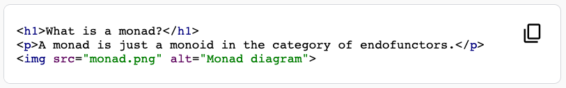
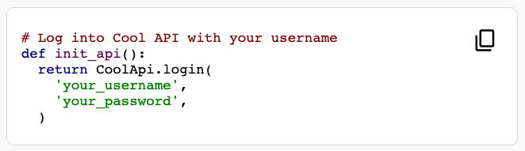
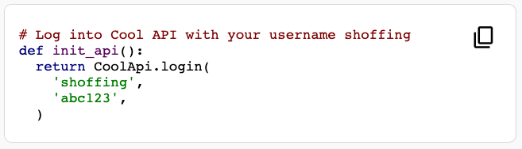

# HTML Specification

Before rendering, Qwiklabs will aggressively sanitize the provided HTML.

- Remove all script tags.
- Remove all style tags.
- Remove all tags, classes, and attributes that are not explicitly allowed.

The allowed tags, classes, and attributes depend on the context.
We currently have two contexts: restricted, and instruction.

## Instruction HTML

### Allowed Tags
- `h1`, `h2`, `h3`, `h4`, `h5`, `h6`
- `p`
- `div`, `span`?
- `table`, `tr`, `td`, `th`, 
- `b`, `i`, `em`, `strong`, `u`, `sup`
- `img`
- `a`
- `aside`
- `button`
- `ul`, `ol`, `li`
- `pre`, `code`
- `blockquote`

# Qwiklabs Custom Elements

We have built a small library of helpful Web Components that you may use within
your lab instructions.

## `<ql-code>` and `<ql-code-block>`

Renders pre-formatted and syntax-highlighted code blocks.

`<ql-code-block>` may be used on its own, or several may be placed within a
`<ql-code>` to show multiple tabs of code blocks.

### Attributes for `<ql-code-block>`

- `language: string|null`

  Language of this code block.

  If not specified, the language will be automatically inferred.
  
  See [the highlight.js docs](https://github.com/highlightjs/highlight.js/blob/main/SUPPORTED_LANGUAGES.md)
  for a list of supported languages.

- `noWrap: boolean`

  By default, code blocks wrap their contents. Setting this attribute will
  make code blocks _not_ wrap text within themselves. Instead, a horizontal
  scrollbar will appear to view the full contents.

- `tabTitle: string|null`

  This is not relevant when using `<ql-code-block>` as a standalone element.

  When using `<ql-code-block>` inside `<ql-code>`, this is the title of the tab for this code block.

- `output: boolean`

  There are two types of code blocks in labs: input and output.

  Input code blocks contain content such as terminal commands, bash
  scripts, lines of code, etc. Things that are meant to be copied and
  pasted. An input code-block has a button to quickly copy the contents.

  Output code blocks contain the results of previous commands, such as
  terminal output - things that are not meant to be copied around. An
  output code-block does not have a copy button, and has different styling.

  Use this property to set this block as "output", instead of "input".

- `templated: boolean`

  Allows the use of templated variables in this code block.
  See [Templated Variables](#templated-variables) below.

### Indentation

Code block indentation is determined by the amount of indentation preceding the
closing tag. Take the following example:

```html
  <ql-code-block language="js">
  console.log("some code in here");
  console.log("some more code here");

  if (2 + 2 == 4) {
    [1, 2, 3].forEach(console.log);
  }
  </ql-code-block>
```

The closing tag above is preceded by two spaces. Every line will be "dedented"
by exactly those two spaces, to produce the following output:

```js
console.log("some code in here");
console.log("some more code here");

if (2 + 2 == 4) {
  [1, 2, 3].forEach(console.log);
}
```

If the indentation of the closing tag does not match the indentation of the
start of every line in the code block (not including lines that are empty or
only whitespace), the code will not be dedented.
For example:

```html
  <ql-code-block language="js">
  console.log("some code in here");
  console.log("some more code here");

  if (2 + 2 == 4) {
    [1, 2, 3].forEach(console.log);
  }
    </ql-code-block>
```

Would be rendered as:

```js
  console.log("some code in here");
  console.log("some more code here");

  if (2 + 2 == 4) {
    [1, 2, 3].forEach(console.log);
  }
```

### Escaping Content

The contents of code blocks must be
[HTML-escaped](https://www.w3.org/International/questions/qa-escapes#use)
in order to render correctly.

This is most relevant for HTML/XML content, for example:

```html
<ql-code-block language="html">
&lt;h1&gt;What is a monad?&lt;/h1&gt;
&lt;p&gt;A monad is just a monoid in the category of endofunctors.&lt;/p&gt;
&lt;img src="monad.png" alt="Monad diagram"&gt;
</ql-code-block>
```

will render as:



### Templated Variables

Much like [\<ql-variable>](#ql-variable), Lab outputs such as usernames,
passwords, project IDs, etc. can be rendered directly within code blocks using
the `templated` attribute.

Code blocks marked as `templated` will allow the usage of triple curly braces
within the code content. The curly braces must contain the output `key` to be
rendered, and optionally may contain a `placeholder` that is rendered before the
lab is started and data is available.

```
{{{key}}}
{{{key|placeholder}}}
```

For example, say you want to use the user's username and password in a snippet
of Python. See the following example:

```html
<ql-code-block language="python" templated>
def init_api():
  # Logs into Cool API with your username {{{project_1.user_1.username}}}
  api = CoolApi.login(
    '{{{project_1.user_1.username|your_username}}}',
    '{{{project_1.user_1.username|your_password}}}',
  )
  return api
</ql-code-block>
```

When the lab page is first opened, only the placeholders will be shown:



After the lab has been started and provisioned, the code block will be updated
to include the lab outputs:



### Markdown Syntax (GitHub integration only)

Code blocks can be rendered with Markdown using triple back ticks:

    ```javascript
    console.log('hello world!');
    ```

Code block properties can be easily utilized in Markdown as well:

    ```python output noWrap
    print('this will be styled as an output code block and will not wrap lines.')
    ```

When rendering a code block through Markdown, HTML-escaping the contents is not
necessary and will be handled automatically.

Also, Markdown code blocks without an explicit `language` specified will be
rendered with `language="plaintext"`.

### Examples

Two tabs of code blocks, one with a custom title.

```html
<ql-code>
  <ql-code-block language="js">
  console.log("some code in here");
  console.log("some more code here");
  [1, 2, 3].forEach(console.log);
  </ql-code-block>
  <ql-code-block language="python" tabTitle="this tab has a custom title!">
  print("some code in here")
  </ql-code-block>
</ql-code>
```

Result:


---

A `<ql-code-block>` on its own without tabs, in "output mode".

```html
<ql-code-block language="json" output>
{
  "id": 321,
  "age": 6,
  "breed": "Daschund",
  "weight": {
    "value": 23,
    "unit": "lb"
  }
}
</ql-code-block>
```

Result:


## `<ql-variable>`

Much like a [templated \<ql-code-block>](#templated-variables), Lab outputs such
as usernames, passwords, project IDs, etc. can be rendered directly within lab
instructions using the `<ql-variable>` component.

### Attributes for `<ql-variable>`

- `key: string`

  The lab output key that this variable should render within the instructions.

- `placeholder: string = '____'`

  Before a lab is started, this variable will render this placeholder value in
  place of the currently unknown actual value.

  This attribute is optional. It defaults to `____`.

### Markdown Syntax (GitHub integration only)

Instead of writing out the full HTML form of `<ql-variable>`, a Markdown
shorthand syntax is available using triple curly braces (`{{{}}}`) surrounding
the key. A custom placeholder may optionally be included following a
vertical pipe character (`|`).

See the next section for examples of what this looks like.

### Examples

A variable rendered within instructions using the default placeholder.

HTML form:
```html
Sign in with your username <ql-variable key="username"></ql-variable> to begin.
```

Equivalent Markdown form:
```md
Sign in with your username {{{ username }}} to begin.
```

Result (lab not started):


Result (lab started):


---

A variable rendered within instructions with a custom placeholder.

HTML form:
```html
Sign in with your username <ql-variable key="username" placeholder="(username)"></ql-variable> to begin.
```

Equivalent Markdown form:
```md
Sign in with your username {{{ username | (username) }}} to begin.
```

Result (lab not started, showing custom placeholder):


Result (lab started, same as the previous example):


## `<ql-activity-tracking>`
TODO: add documentation

## `<ql-multiple-choice-probe>`
TODO: add documentation

## `<ql-multiple-select-probe>`
TODO: add documentation

## `<ql-true-false-probe>`
TODO: add documentation

## `<ql-stem>`
TODO: add documentation

## `<ql-option>`
TODO: add documentation

## `<ql-warningbox>`
TODO: add documentation

## `<ql-infobox>`
TODO: add documentation

## `<ql-video>`

Videos can be inserted, either with a link to the direct video file source or as a YouTube video ID.

Details:

Attribute | Type | Required | Description
--- | --- | --- | ---
src | string | true* | A URL that leads directly to a video file.
youtubeId | string | true* | The ID of the YouTube video to embed. <br/> (the part of the URL after `?v=`)
width | integer | false | Display width of the video, in pixels.
height | integer | false | Display height of the video, in pixels.
loop | boolean | false | Whether to loop this video automatically.
autoplay | boolean | false | Whether to play this video immediately on page load.
controls | boolean | false | Whether to show video playback and volume controls. <br/> Only applicable to videos using `src`.
lang | string | false | Subtitle preference for YouTube videos (2-letter language code)
 

\* One of `src` or `youtubeId` must be present, but not both.

#### Direct Source Videos

Source:
```html
<ql-video src="vid/test_video.mp4" controls></ql-video>
<ql-video src="vid/test_video.mp4" autoplay loop width="100" height="100"></ql-video>
```

Rendered:

<ql-video src="vid/test_video.mp4" controls></ql-video>

<ql-video src="vid/test_video.mp4" autoplay loop width="100" height="100"></ql-video>

#### YouTube Videos
```html
<ql-video youtubeId="ew-r46FmzSM"></ql-video>
<ql-video youtubeId="ew-r46FmzSM" width="960" height="540"></ql-video>
```

Rendered:

<ql-video youtubeId="ew-r46FmzSM"></ql-video>

<ql-video youtubeId="ew-r46FmzSM" width="960" height="540"></ql-video>

# Features

- Automatic table of contents generation.
  - `<h1>` is the title of the document and will not be included in TOC.
  - `<h2>`s will be navigable links in the TOC.
- By not styling yourself, your instructions will not become outdated as the Qwiklabs learning interface changes.
