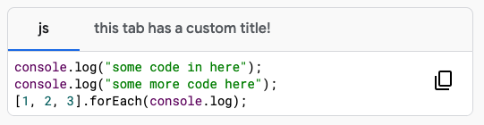
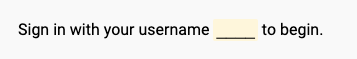
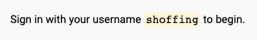

# HTML Specification

Before rendering, Qwiklabs will aggressively sanitize the provided HTML.

- Remove all script tags.
- Remove all style tags.
- Remove all tags, classes, and attributes that are not explicitly allowed.

The allowed tags, classes, and attributes depend on the context.
We currently have two contexts: restricted, and instruction.

## Instruction HTML

### Allowed Tags
- `h1`, `h2`, `h3`, `h4`, `h5`, `h6`
- `p`
- `div`, `span`?
- `table`, `tr`, `td`, `th`, 
- `b`, `i`, `em`, `strong`, `u`, `sup`
- `img`
- `a`
- `aside`
- `button`
- `ul`, `ol`, `li`
- `pre`, `code`
- `blockquote`

# Qwiklabs Custom Elements

We have built a small library of helpful Web Components that you may use within
your lab instructions.

## `<ql-code>` and `<ql-code-block>`

Renders pre-formatted and syntax-highlighted code blocks.

`<ql-code-block>` may be used on its own, or several may be placed within a
`<ql-code>` to show multiple tabs of code blocks.

### Attributes for `<ql-code-block>`

- `language: string|null`

  Language of this code block.

  If not specified, the language will be automatically inferred.

- `tabTitle: string|null`

  This is not relevant when using `<ql-code-block>` as a standalone element.

  When using `<ql-code-block>` inside `<ql-code>`, this is the title of the tab for this code block.

- `output: boolean`

  There are two types of code blocks in labs: input and output.

  Input code blocks contain content such as terminal commands, bash
  scripts, lines of code, etc. Things that are meant to be copied and
  pasted. An input code-block has a button to quickly copy the contents.

  Output code blocks contain the results of previous commands, such as
  terminal output - things that are not meant to be copied around. An
  output code-block does not have a copy button, and has different styling.

  Use this property to set this block as "output", instead of "input".

### Examples

Two tabs of code blocks, one with a custom title.

```html
<ql-code>
  <ql-code-block language="js">
    console.log("some code in here");
    console.log("some more code here");
    [1, 2, 3].forEach(console.log);
  </ql-code-block>
  <ql-code-block language="python" tabTitle="this tab has a custom title!">
    print("some code in here")
  </ql-code-block>
</ql-code>
```

Result:



---

A `<ql-code-block>` on its own without tabs, in "output mode".

```html
<ql-code-block lang="json" output>
  {
    "id": 321,
    "age": 6,
    "breed": "Daschund",
    "weight": {
      "value": 23,
      "unit": "lb"
    }
  }
</ql-code-block>
```

Result:


## `<ql-variable>`

Lab outputs such as usernames, passwords, project IDs, etc. can be rendered
directly within lab instructions using the `<ql-variable>` component.

### Attributes for `<ql-variable>`

- `key: string`

  The lab output key that this variable should render within the instructions.

- `placeholder: string = '____'`

  Before a lab is started, this variable will render this placeholder value in
  place of the currently unknown actual value.

  This attribute is optional. It defaults to `____`.

### Markdown Syntax

Instead of writing out the full HTML form of `<ql-variable>`, a Markdown
shorthand syntax is available using triple curly braces (`{{{}}}`) surrounding
the key. A custom placeholder may optionally be included following a
vertical pipe character (`|`).

See the next section for examples of what this looks like.

### Examples

A variable rendered within instructions using the default placeholder.

HTML form:
```html
Sign in with your username <ql-variable key="username"></ql-variable> to begin.
```

Equivalent Markdown form:
```md
Sign in with your username {{{ username }}} to begin.
```

Result (lab not started):



Result (lab started):



---

A variable rendered within instructions with a custom placeholder.

HTML form:
```html
Sign in with your username <ql-variable key="username" placeholder="(username)"></ql-variable> to begin.
```

Equivalent Markdown form:
```md
Sign in with your username {{{ username | (username) }}} to begin.
```

Result (lab not started, showing custom placeholder):


Result (lab started, same as the previous example):


## `<ql-activity-tracking>`
TODO: add documentation

## `<ql-multiple-choice-probe>`
TODO: add documentation

## `<ql-multiple-select-probe>`
TODO: add documentation

## `<ql-true-false-probe>`
TODO: add documentation

## `<ql-stem>`
TODO: add documentation

## `<ql-option>`
TODO: add documentation

## `<ql-warningbox>`
TODO: add documentation

## `<ql-infobox>`
TODO: add documentation

## `<ql-video>`
TODO: add documentation

# Features

- Automatic table of contents generation.
  - `<h1>` is the title of the document and will not be included in TOC.
  - `<h2>`s will be navigable links in the TOC.
- By not styling yourself, your instructions will not become outdated as the Qwiklabs learning interface changes.
